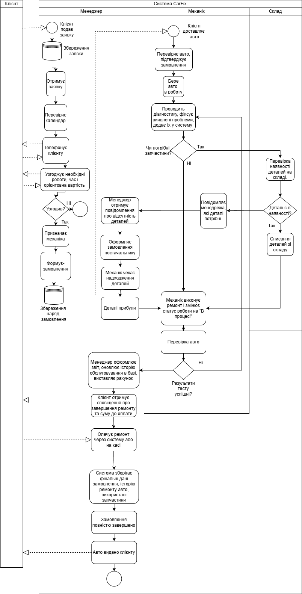

# CarFix
  Ринок автосервісних послуг в Україні активно зростає у зв’язку зі збільшенням кількості транспортних засобів. Станом на 2024 рік в Україні зареєстровано понад 10 мільйонів автомобілів, і щороку ця кількість збільшується на 3–5%. Це зумовлює підвищення попиту на технічне обслуговування, ремонт та діагностику транспортних засобів.

За спостереженнями галузевих експертів, автосервіси, які використовують програмні рішення для управління замовленнями, фінансами та складом, мають у середньому на 25–40% більший прибуток порівняно з тими, що ведуть облік вручну або у таблицях Excel.

Такі підприємства скорочують втрати часу на пошук даних, мінімізують помилки у фінансовій звітності, краще контролюють закупівлі та роботу персоналу. Натомість неавтоматизовані СТО стикаються з проблемами дублювання інформації, відсутністю історії клієнтів та недостатньою прозорістю руху коштів.

У зв’язку з цим постає потреба у створенні єдиного інформаційного рішення, яке об’єднає облік клієнтів, фінансів, запасних частин і роботи працівників у зручному інтерфейсі.

Для вирішення цих проблем пропонується створення інформаційної системи управління автосервісом “CarFix”, яка забезпечує:
- Прозорість фінансових операцій — контроль доходів, витрат, закупівель і фінансових потоків у реальному часі.
- Автоматизований облік клієнтів та замовлень — реєстрація, історія звернень, повторні ремонти.
- Моніторинг роботи працівників — фіксація виконаних завдань, відпрацьованих годин і ефективності кожного спеціаліста.
- Облік запасних частин і витратних матеріалів — аналіз залишків, контроль закупівель і оптимізація складу.
- Аналітику діяльності СТО — формування звітів, оцінка завантаженості, статистика клієнтів і прибутковості.

---

# Бачення проєкту
## Проблеми та потреби
Більшість станцій технічного обслуговуванн стикаються з низкою організаційних і управлінських проблем.
Основні з них:
1. Відсутність централізованої системи обліку клієнтів та замовлень.
Багато автосервісів досі використовують паперові журнали або Excel-таблиці. Це призводить до втрати інформації, дублювання записів і складності у відстеженні історії обслуговування клієнтів.
2. Непрозорий контроль фінансів. Витрати на запчастини, оплату праці та інші операції часто не фіксуються належним чином, що ускладнює аналіз прибутковості підприємства.
3. Відсутність автоматизованого управління складом. Дані про залишки запчастин часто не оновлюються вчасно, що призводить до нестачі або надлишку деталей, а також до неефективних закупівель.
4. Складність контролю роботи персоналу. Керівники не мають можливості швидко оцінити завантаженість механіків, ефективність їхньої роботи та якість виконаних послуг.
5. Відсутність аналітики та статистики. Без автоматичного збору даних неможливо побачити динаміку доходів, найпопулярніші послуги, витрати на матеріали чи кількість повторних звернень клієнтів.
6. Обмежена комунікація з клієнтами. Запис на ремонт або уточнення статусу замовлення часто відбуваються телефоном, що не зручно для клієнтів і не дозволяє зберігати історію звернень.

Розробка інформаційної системи CarFix спрямована на усунення зазначених проблем шляхом:
- централізації обліку клієнтів, автомобілів і замовлень;
- забезпечення прозорого фінансового моніторингу доходів, витрат і закупівель;
- автоматизації управління складом і запасними частинами;
- моніторингу продуктивності та завантаженості працівників;
- формування звітів та аналітичних даних для керівництва;
- покращення комунікації з клієнтами через зручний цифровий інтерфейс.

## Цільова аудиторія
**1. Власники автосервісів**

    Pain points:
    - відсутність прозорого контролю доходів і витрат;
    - складнощі з моніторингом роботи працівників;
    - неефективне планування бюджету та закупівель.
    
    Рішення:
    - автоматизований фінансовий облік і звітність;
    - контроль виконання робіт у режимі реального часу;
    - аналітика прибутковості та витрат.
**2. Менеджери та адміністратори**

    Pain points:  
    - відсутність централізованої бази замовлень і клієнтів;
    - дублювання записів або втрата інформації;
    - неможливість швидко координувати роботу між відділами.

    Рішення:
    - єдина система управління замовленнями;
    - календар записів клієнтів;
    - зручна комунікація між клієнтом і працівниками.
**3. Працівники (механіки, електрики, майстри)**

    Pain points:
    - неясні завдання або дублювання робіт;
    - відсутність оперативної інформації про наявність запчастин;
    - ручне ведення обліку виконаних робіт.

    Рішення:
    - електронні замовлення із чітким описом робіт;
    - доступ до складу в реальному часі;
    - автоматичне фіксування виконаних завдань.

**4. Клієнти автосервісу**

    Pain points:
    - складно записатися або дізнатися статус ремонту;
    - немає історії обслуговування автомобіля;
    - недостатня прозорість у вартості послуг.

    Рішення:
    - онлайн-запис на ремонт;
    - перегляд історії обслуговування;
    - повідомлення про готовність авто та витрати.

**5. Ринок**

Ринок автосервісних послуг активно розвивається, але більшість СТО працюють без систем обліку, що знижує ефективність. CarFix націлений на малі та середні підприємства, які прагнуть оптимізувати процеси без впровадження складних ERP-систем.

# Бачення кінцевого результату

Впровадження інформаційної системи CarFix користувачі та бізнес отримають комплексне рішення для автоматизації всіх ключових процесів автосервісу — від прийому замовлення до фінансової аналітики.

## 1. Що отримує користувач?

**Власники**
- **Повний контроль і прозорість:** Замість здогадок і паперових звітів — чітка панель управління з реальними даними про доходи, витрати, завантаженість та прибутковість.
- **Контроль:** Впевненість, що процеси працюють, персонал контролюється, а фінанси під обліком.
- **Час на розвиток:** Автоматизація рутини звільняє час для стратегічних завдань — залучення нових клієнтів, відкриття нових напрямків, підвищення якості.

**Менеджери та адміністратори**
- **Порядок замість хаосу:** Єдина система, де видно всі замовлення, історію клієнтів і завантаженість майстрів.
- **Ефективність:** Швидке оформлення замовлень, автоматичні сповіщення для клієнтів та миттєвий доступ до потрібної інформації.
- **Підвищення якості сервісу:** Можливість приділяти більше уваги клієнту, пропонуючи персоналізований підхід на основі історії обслуговування.

**Працівники (механіки, електрики, майстри)**
- **Чіткість завдань:** Електронний наряд-замовлення, де вказано, що потрібно зробити, які запчастини потрібні та яка історія у цього авто.
- **Зручність:** Прямий доступ до інформації про наявність запчастин на складі.
- **Справедлива оцінка роботи:** Простий облік виконаних операцій, що лягає в основу розрахунку зарплати та оцінки продуктивності.

**Клієнти**
- **Зручність взаємодії:** можливість записатися онлайн, отримувати повідомлення про статус ремонту та переглядати історію обслуговування.
- **Прозорість послуг:** клієнт бачить вартість робіт, запчастин і терміни виконання, що підвищує довіру.
- **Покращений сервіс:** швидше обслуговування, персоналізовані пропозиції та збереження історії авто.

## 2. Що отримає бізнес?

- **Зростання прибутку:** За рахунок збільшення пропускної здатності, зменшення помилок та можливості пропонувати додаткові послуги на основі даних.
- **Скорочення витрат:** Завдяки оптимальному управлінню складом запчастин та зменшенню втрат від людського фактору.
- **Прогнозованість:** Можливість аналізувати дані для фінансового планування та прийняття обґрунтованих бізнес-рішень.
- **Прискорення циклу обслуговування:** Час від запису клієнта до видачі авто значно скорочується.
- **Масштабованість:** Налагоджену цифрову систему легко розширити, якщо бізнес вирішить відкрити нову філію або додати нові пости.
- **Підвищення лояльності клієнтів:** Прозорий та зручний сервіс перетворює разових клієнтів на постійних.
- **Цінний актив:** Накопичена база даних про клієнтів, автомобілі та операції стає цінним активом компанії, який можна використовувати для маркетингу та аналітики.

## Основні цілі (SMART-формат)

### Глобальна мета проекту
Розробити та запустити **MVP системи "CarFix"**. MVP повинен включати ключовий функціонал:  
- модуль управління замовленнями,  
- клієнтську базу даних (клієнти + авто),  
- модуль онлайн-запису.

Успішний запуск вимірюється залученням перших реальних користувачів.  
**Ціль:** 3+ автосервісів (малі/середні СТО) почнуть використовувати систему для ведення своєї щоденної діяльності.  

Досягнення цієї мети підтвердить ринковий попит на продукт та життєздатність бізнес-ідеї, що є головною задачею практичного проекту.  
Ціль має бути досягнута протягом **6 місяців** з моменту початку активної фази розробки.

### SMART-ціль проекту
Розробити та запустити MVP-версію системи "CarFix" (з модулями замовлень, клієнтів та онлайн-запису) і **залучити 3 реальних СТО** до її постійного використання протягом перших 6 місяців, щоб підтвердити ринковий попит на продукт.

## Конкурентні переваги або унікальна ціннісна пропозиція (USP)

**CarFix** — це інтелектуальна платформа для управління автосервісом, яка об’єднує всі ключові процеси в одному місці:  
- планування та облік замовлень,  
- клієнтська база,  
- управління запасами,  
- фінансова аналітика,  
- контроль роботи персоналу.

Система створена для малих і середніх СТО, які прагнуть:  
- зменшити втрати часу на паперовий облік,  
- уникнути хаосу в даних,  
- контролювати прибутки, витрати та ефективність працівників у реальному часі.

## Обмеження, припущення, залежності

### Обмеження
- MVP розробляється тільки для малих та середніх СТО.  
- Система працює лише на веб-платформі та десктопах (мобільний додаток на старті не реалізується).  
- Використовується **Java + Spring Boot** та реляційна БД.  
- Обмежений термін розробки MVP — **6 місяців**.  
- Система повинна підтримувати до **100 активних користувачів одночасно** на перших етапах.  

### Припущення
- СТО погодяться на тестування MVP і нададуть доступ до своїх даних.  
- Клієнти автосервісу будуть користуватися онлайн-записом.  
- Працівники СТО навчаться користуватися системою без тривалого курсу.  
- Інтернет-з’єднання у СТО достатньо стабільне для роботи веб-додатку.  
- Доступні стандартні пристрої (ПК, планшети) для роботи з системою.  

### Залежності
- Доступ до даних клієнтів та автомобілів від пілотних СТО.  
- Стабільна робота серверного середовища та БД.  
- Вчасна розробка ключових модулів: замовлення, клієнтська база, онлайн-запис.  
- Підтримка і зворотний зв’язок від тестових користувачів для покращення MVP.  
- Наявність ресурсів для навчання персоналу СТО (короткі інструкції або відео).

---

# Специфікації проєкту

## Опис проєкту
**CarFix** — це вебзастосунок для автоматизації роботи автосервісів (СТО).  
Система дозволяє вести базу клієнтів, облік автомобілів, замовлень, запасних частин, витрат і контролювати роботу персоналу.  
Також передбачено аналітику доходів, історію клієнтів і онлайн-запис.

## Цілі проєкту
- Автоматизація щоденних процесів у автосервісі.  
- Забезпечення прозорого контролю фінансів, закупівель та роботи персоналу.  
- Зменшення кількості помилок через людський фактор.  
- Підвищення зручності обслуговування клієнтів (онлайн-запис, історія авто).

## Обсяг проєкту (Scope)

### Включає
- Реєстрація та авторизація користувачів (різні ролі: власник, менеджер, механік, клієнт)  
- Облік замовлень (ремонт, діагностика, ТО)  
- База клієнтів та автомобілів  
- Управління складом (запчастини, витрати, залишки)  
- Онлайн-запис клієнтів  
- Панель адміністратора з аналітикою (прибуток, завантаженість)  
- Звіти (щоденні, місячні, фінансові)

### Не включає
- Інтеграцію з банківськими платіжними системами  
- Повноцінну CRM або ERP  
- Мобільний застосунок (на етапі MVP)

## Типи користувачів

### **Власник**
- Контролює фінанси, персонал, звіти  
- Перегляд аналітики, розподіл бюджету  

### **Менеджер**
- Приймає клієнтів, створює замовлення, контролює запаси  
- Створення/редагування замовлень  

### **Механік/Електрик**
- Виконує ремонт, звітує про виконання  
- Позначення статусу робіт  

### **Клієнт**
- Запис на обслуговування, перегляд історії авто  
- Онлайн-запис, історія візитів

## Функціональні та нефункціональні вимоги, технології та очікуваний результат

## Функціональні вимоги
- Система повинна дозволяти створювати, редагувати та видаляти замовлення.  
- Користувач повинен мати можливість фільтрувати замовлення за статусом.  
- Менеджер має доступ до складу та може додавати запчастини.  
- Власник може переглядати фінансові звіти та статистику.  
- Клієнт може записатися онлайн через форму.
  

## Нефункціональні вимоги
- Вебінтерфейс повинен бути адаптивним (для ПК і планшетів).  
- Час відповіді — не більше 2 секунд при нормальному навантаженні.  
- Дані клієнтів мають зберігатися у захищеній базі.  
- Система має підтримувати мінімум 50 одночасних користувачів.

## Технології
- **Back-end:** Java + Spring Boot  
- **Front-end:** React  
- **База даних:** PostgreSQL  
- **Build:** Maven  
- **ORM:** Hibernate / JPA  
- **Інші:** REST API, JWT Security

## Очікуваний результат
Готовий **MVP-додаток CarFix**, який дозволяє вести клієнтів, замовлення, склад та фінансову аналітику.  
Простий інтерфейс для СТО будь-якого масштабу.

---

# План складу команди

## Список ролей

### **Project Owner**
- Координація роботи команди, планування, контроль термінів, аналіз вимог, документування, зв’язок з “клієнтами” (СТО)

### **Tech Lead**
- Проєктування архітектури системи, технічні рішення, code review, консультування команди розробників

### **Frontend Developer**
- Реалізація інтерфейсу користувача, інтеграція з backend API, розробка MVP-модулів

### **QA**
- Перевірка роботи системи, тестування модулів

### **UX/UI Designer**
- Дизайн інтерфейсу, юзабіліті, макети веб-додатку

### **Консультанти**
- Експерти з автосервісу або фінансів для перевірки реалістичності функцій

## Рівень компетенцій та обсяг залучення

| Роль              | Залучення   | Основні компетенції                                      |
|------------------|------------|---------------------------------------------------------|
| Project Owner     | part-time  | Управління проектами, планування, комунікації, бізнес-аналіз, UML, вимоги |
| Tech Lead         | full-time  | Java, Spring Boot, проєктування архітектури, інтеграції |
| Frontend Developer| full-time  | HTML, CSS, JavaScript, React, робота з REST API, адаптивна верстка |
| QA                | part-time  | Тестування, автоматизація                               |
| UX/UI Designer    | part-time  | Figma, UX-дизайн                                       |
| Консультанти      | on-demand  | Автосервісний бізнес, фінанси                           |

## Відповідальність (RACI-матриця)

| Завдання                   | Project Owner | Tech Lead | Frontend Developer | QA | UX/UI Designer |
|----------------------------|---------------|-----------|------------------|----|----------------|
| Збір вимог                 | R             | C         | I                | I  | I              |
| Дизайн UI                  | C             | C         | I                | I  | R              |
| Розробка модуля замовлень  | C             | A         | R                | I  | I              |
| Тестування MVP             | C             | C         | I                | R  | I              |
| Звітність, планування      | A             | I         | I                | I  | I              |

**Легенда:**
- **R** — Responsible (Відповідальний)  
- **A** — Accountable (Власник процесу)  
- **C** — Consulted (Консультант/залучений до консультацій)  
- **I** — Informed (Повідомлений)  

## План комунікацій і взаємодії між ролями

### Як команда буде взаємодіяти
- Щотижневі онлайн-зустрічі для обговорення прогресу (Zoom / Teams)  
- Канал для щоденної комунікації (Telegram / Discord)  
- Спільний репозиторій для коду (GitHub)  
- Документація у Google Docs / Confluence  

### Зовнішні консультанти або підрядники
- **Експерт з автосервісу** — перевірка реалістичності функцій (on-demand)  
- **Фінансовий консультант** — поради щодо модуля фінансів і звітності (on-demand)

---

# Блок-схема процесу обслуговування автомобіля

## Призначення
Ця блок-схема показує, як система **CarFix** обробляє замовлення на обслуговування авто — від подання заявки клієнтом до завершення ремонту та тестування.

## Основні кроки процесу

1. **Початок:**  
   Клієнт подає заявку на обслуговування автомобіля. Заявка записується в базу даних.

2. **Доставка авто та прийом:**  
   - Менеджер зв’язується з клієнтом для уточнення деталей ремонту.  
   - Узгоджуються необхідні роботи, час і орієнтовна вартість.  
   - Після узгодження створюється замовлення в системі.

3. **Доставка авто до СТО:**  
   Клієнт привозить авто у визначений час.

4. **Прийом авто механіком:**  
   Механік перевіряє авто, підтверджує замовлення і починає роботу.

5. **Огляд та діагностика:**  
   Механік проводить огляд автомобіля, фіксує виявлені проблеми, додає їх у систему.

6. **Рішення:**  
   "Чи потрібні запчастини для ремонту?"  
   - **Так:** перевірка наявності деталей на складі.  
   - **Ні:** перехід до етапу ремонту.

7. **Перевірка складу:**  
   - Якщо потрібні деталі — система перевіряє їх у базі складу.  
   - Рішення: "Деталі є в наявності?"  
     - **Так:** списання деталей зі складу.  
     - **Ні:** менеджер отримує повідомлення про відсутність деталей і оформлює замовлення постачальнику. Механік чекає надходження деталей.

8. **Ремонт автомобіля:**  
   Механік виконує ремонт і змінює статус роботи на **“В процесі”** або **“Завершено”**.

9. **Тестування:**  
   Після завершення ремонту проводиться перевірка авто.  
   - Рішення: "Результати тесту успішні?"  
     - **Так:** перехід до завершення замовлення.  
     - **Ні:** повернення до етапу діагностики.

10. **Завершення замовлення:**  
    - Менеджер оформлює звіт, оновлює історію обслуговування в базі, виставляє рахунок і повідомляє клієнта.  
    - Механік позначає замовлення як виконане: статус у системі змінюється на **“Виконано, очікується оплата”**.  
    - Менеджер повідомляє клієнта: клієнт отримує сповіщення про завершення ремонту та суму до оплати.

11. **Оплата клієнтом:**  
    Клієнт оплачує ремонт через систему або на касі.

12. **Оновлення історії замовлень:**  
    Система зберігає фінальні дані замовлення, історію ремонту авто та використані запчастини.

13. **Кінець процесу:**  
    Замовлення повністю завершено, авто видано клієнту.

